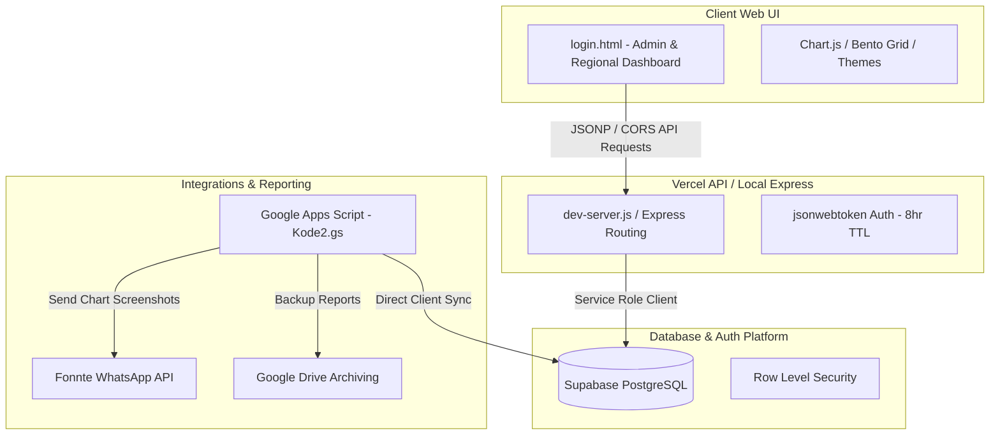

# 📐 AGRI-PAM - Technical Blueprint & Architecture

This document details the complete system architecture, data models, API endpoints, frontend design principles, and deployment setup for the **AGRI-PAM (Agrinas Panen Monitoring)** application.

---

## 1. System Overview

AGRI-PAM is a real-time oil palm harvest monitoring system built using a hybrid cloud architecture. It replaces the legacy pure Google Sheets backend with a secure, performant PostgreSQL database while keeping Google Sheets compatibility via Apps Script.

### High-Level Architecture Diagram


---

## 2. Technology Stack

- **Frontend**: HTML5, Vanilla CSS, Vanilla JS, Tailwind CSS, Chart.js (v4), Material Symbols.
- **Backend API Server**: Express.js (Express 5.x) / Vercel Serverless Functions.
- **Security & Session**: JSON Web Tokens (`jsonwebtoken`) with an 8-hour Time-to-Live (TTL).
- **Database**: PostgreSQL hosted on Supabase.
- **Automation / Scheduled Reporting**: Google Apps Script (GAS), Fonnte API (WhatsApp Gateway), Google Drive API.

---

## 3. Database Schema

The PostgreSQL schema is located in `supabase/schema.sql`. It contains the following tables and functions:

### 3.1. Tables

1. **`regions`**: Stores login credentials and master data for each region.
   - `id` (UUID, Primary Key)
   - `region_name` (VARCHAR, Unique, e.g., 'Aceh', 'ADMIN')
   - `password_hash` (VARCHAR, bcrypt hash)
   - `is_active` (BOOLEAN, Default: true)
   - `created_at` / `updated_at` (TIMESTAMPTZ)

2. **`database_input`**: Stores hourly harvest realisations.
   - `id` (BIGINT, Primary Key)
   - `tanggal` (DATE)
   - `jam` (VARCHAR, e.g., '08.00')
   - `tonase` (NUMERIC)
   - `region` (VARCHAR)
   - `created_by` (VARCHAR)
   - `created_at` (TIMESTAMPTZ)

3. **`data_estimasi`**: Stores daily harvest estimations/targets for each region.
   - `id` (BIGINT, Primary Key)
   - `tanggal` (DATE)
   - `est_panen` (NUMERIC, in kg)
   - `est_kirim` (NUMERIC, in kg)
   - `luas_panen` (NUMERIC)
   - `region` (VARCHAR)
   - `created_at` (TIMESTAMPTZ)

4. **`sesi_aktif`**: Audits and manages valid JWT login sessions.
   - `id` (BIGINT, Primary Key)
   - `region` (VARCHAR)
   - `token` (TEXT)
   - `login_time` (TIMESTAMPTZ)
   - `expiry` (TIMESTAMPTZ)
   - `status` (VARCHAR, 'Aktif' / 'Logout')
   - `ip_address` (VARCHAR)

5. **`rate_limit`**: Protects against brute-force login attempts.
   - `region` (VARCHAR, Primary Key)
   - `attempts` (INT)
   - `window_start` (TIMESTAMPTZ)
   - `updated_at` (TIMESTAMPTZ)

6. **`audit_log`**: Holds security logs.
   - `id` (BIGINT, Primary Key)
   - `region` (VARCHAR)
   - `action` (VARCHAR)
   - `detail` (TEXT)
   - `created_at` (TIMESTAMPTZ)

### 3.2. Database Security & Custom Functions

- **Row Level Security (RLS)**: Enforced across sensitive tables. Direct public client access is blocked, and data updates must go through server-side authenticated APIs.
- **Bcrypt Hashing**: Uses PostgreSQL's `pgcrypto` extension for password verification.
- **Password Check RPC (`check_password`)**:
  ```sql
  CREATE OR REPLACE FUNCTION check_password(p_region TEXT, p_password TEXT)
  RETURNS BOOLEAN AS $$
  ...
  RETURN stored_hash = crypt(p_password, stored_hash);
  $$ LANGUAGE plpgsql SECURITY DEFINER;
  ```

---

## 4. Backend API Endpoints

The API is served under `/api/*` and mapped dynamically to individual files in `/api/*.js`:

| Route | Method | File | Description |
|---|---|---|---|
| `/api/auth?action=login` | `POST`/`GET` | `api/auth.js` | Authenticates region via `check_password`, creates session, and issues JWT. Supports rate-limiting. |
| `/api/auth?action=logout` | `POST`/`GET` | `api/auth.js` | Marks active session token as "Logout". |
| `/api/auth?action=refresh` | `POST`/`GET` | `api/auth.js` | Validates JWT and extends session expiration. |
| `/api/realisasi` | `POST`/`GET` | `api/realisasi.js` | Fetches, creates, and deletes hourly harvest realisation inputs. |
| `/api/estimasi` | `POST`/`GET` | `api/estimasi.js` | Fetches, saves, and deletes daily regional target estimations. |
| `/api/sap` | `POST`/`GET` | `api/sap.js` | Fetches shipping letters (Surat Angkut) data for SAP integration. |
| `/api/deleteRequest` | `POST`/`GET` | `api/deleteRequest.js` | Manages request validation for data deletion. |

---

## 5. Frontend & UI Engine

The frontend is a single-page dashboard application (`login.html`) optimized for mobile-first bento layout.

### 5.1. Bento Grid Architecture
The dashboard uses Tailwind CSS's flexible grid layout to divide information into independent "bento boxes":
- **Header Card**: Live WIB clock, dates, and active region name.
- **Summary Bento Boxes**: Total Estimasi, Total Realisasi, and Persentase Pencapaian in high-font readability.
- **Form Card**: Interactive harvest report inputs.
- **Visualisation Cards**: Hourly and National comparative charts.
- **Navigation Bar**: Clean bottom-tab navigation for quick swapping between Monitoring, SAP, and Infografis.

### 5.2. Chart.js Configurations
The application implements two major charts:

1. **Realisasi Tiap Jam (`#realisasiChart`)**:
   - Displays hourly production realisations as green bars.
   - Connected via a straight dash connecting line representing the trend.
   - Uses a custom canvas drawing plugin (`chartDataLabels`) to display the value and the hourly increase/decrease percentage (e.g., `▲ +10.5%` or `▼ -3.2%`) underneath each value label.
   - Interactive Tooltips show values on hover.

2. **Realisasi vs Estimasi Panen (`#realisasiVsEstimasiChart`)**:
   - Renders **Realisasi/Aktual** as a solid green line with white data-dots.
   - Renders **RKAP/Estimasi Target** as a red dashed line (`borderDash: [5, 5]`) without dots.
   - Float-drawn data labels are placed directly above each point, formatted with standard Indonesian thousands separators (e.g. `10.077`).
   - Implements a custom line-based HTML legend:
     - 🟢 **Realisasi Panen** (represented by a green horizontal line with a white/green circle).
     - 🔴 **Estimasi Panen** (represented by a red dashed line).

### 5.3. Dark & Light Mode Theme Toggle
- A button class `.header-theme-toggle` in the header allows users to swap between theme styles.
- Toggling modifies `document.documentElement.setAttribute("data-theme", "dark" | "light")` and stores selection in local storage.
- Custom CSS overrides theme variables globally, automatically updating dashboard backgrounds, sidebar navigation selectors, headers, clocks, cards, inputs, and database tables to a unified dark theme.

---

## 6. Automation & External Reporting

- **Google Apps Script Integration (`Kode2.gs`)**:
  Runs in the background on Google Drive, bridging Supabase data with scheduled reporting.
- **Scheduled Trigger**:
  Triggers a headless dashboard screenshot generator every hour between `06.00` and `17.30` WIB.
- **WhatsApp Dispatch (Fonnte API)**:
  Uploads compiled JPEG chart screenshots to Google Drive and dispatches automatic visual report cards to WhatsApp groups via the Fonnte Gateway API.

---

## 7. Setup & Run Instructions

### 7.1. Quick Run Localhost
To run the server locally, double-click **`run-dev.bat`** in the project root directory. This batch script will:
1. Run `npm install` to install node modules.
2. Start the local server by running `node dev-server.js`.
3. Open `http://localhost:3000/` automatically in your browser.

### 7.2. Manual CLI Run
```bash
# Navigate to project root
cd AGRIPAM

# Run directly using Node
node dev-server.js
```
The server loads `.env` variables manually and listens on port `3000`.
