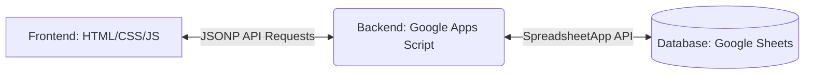

# Modul Fitur Sistem AGRIPAM
*(Agrinas Panen Monitoring App)*

Modul ini mendokumentasikan seluruh fitur, arsitektur, mekanisme keamanan, dan alur validasi yang berjalan di dalam sistem **AGRIPAM**.

---

## 1. Ikhtisar Sistem & Arsitektur
AGRIPAM adalah aplikasi berbasis web yang dirancang khusus untuk memonitoring realisasi panen Tandan Buah Segar (TBS) kelapa sawit secara berkala (tiap jam) dan membandingkannya dengan rencana estimasi yang telah diinput sebelumnya.

### Arsitektur Teknologi
Sistem ini menggunakan arsitektur *serverless* berbasis Google Ecosystem untuk kemudahan integrasi data:

1. **Frontend (Vercel)**: Single Page Application (SPA) berbasis HTML5, CSS kustom, dan Vanilla Javascript yang dideploy di platform Vercel.
2. **Backend/API (Google Apps Script)**: Berupa script endpoint (Code.js) yang menerima request via JSONP (*JSON with Padding*) untuk mengatasi isu CORS.
3. **Database (Google Sheets)**: Menggunakan Google Spreadsheet dengan tiga sheet utama:
   - `Database_Input`: Menyimpan data realisasi panen per jam.
   - `Data_Estimasi`: Menyimpan data rencana panen harian.
   - `Sesi_Aktif`: Menyimpan catatan audit log sesi pengguna yang sedang aktif/login.

---

## 2. Fitur Keamanan & Manajemen Sesi

Untuk menjamin validitas pengisian data dari lapangan, AGRIPAM dilengkapi sistem keamanan terdistribusi:

### A. Autentikasi Berbasis Region
* Login tidak menggunakan username individu, melainkan menggunakan identitas **Region/Wilayah** dengan password unik masing-masing.
* Sistem mengenali **23 Region** operasional dan **1 Akun ADMIN**.

### B. Rate Limiting Login
* Mencegah percobaan masuk secara berulang (*brute force*).
* **Batasan**: Maksimal 5 kali percobaan gagal dalam rentang waktu 10 menit per region. Jika dilanggar, login akan dikunci selama sisa waktu jendela window.

### C. Proteksi Multi-Tab (Single Session Enforcement)
Menggunakan kombinasi `ScriptProperties` di backend dan `BroadcastChannel` API di frontend:
* **Deteksi Perangkat Lain**: Jika sebuah Region melakukan login di perangkat/tab baru, sesi aktif di perangkat/tab lama akan langsung di-override (dibatalkan) dan dipaksa *logout* otomatis.
* **Komunikasi Antar Tab**: Tab yang sedang terbuka akan saling mengirim sinyal status sesi untuk mendeteksi duplikasi.

### D. Heartbeat & Masa Aktif Sesi (TTL)
* **Session TTL**: Setiap sesi login hanya berlaku selama **8 jam**.
* **Heartbeat**: Sistem secara otomatis mengirimkan request penyegaran sesi (`refreshToken`) setiap **30 menit** saat aplikasi sedang dibuka agar sesi tidak kedaluwarsa di tengah penginputan.

---

## 3. Fitur Penginputan & Validasi Data

### A. Penginputan Realisasi Panen per Jam
* Pengguna menginput jumlah realisasi panen dalam satuan **Ton**.
* **Slot Jam**: Tersedia 12 slot pengisian (pukul 06.00, 07.00, 08.00, 09.00, 10.00, 11.00, 12.00, 13.00, 14.00, 15.00, 16.00, dan 17.30).
* **Validasi Batas**: Nilai input tonase dibatasi antara **0 hingga 5.000 Ton** untuk mencegah salah ketik (*typo* angka terlalu besar).
* **Koreksi Data**: Data yang sudah diinput pada jam tertentu tidak bisa ditimpa langsung. Pengguna harus menekan tombol **"Hapus Jam Ini"** untuk menghapus baris data di database terlebih dahulu sebelum menginput ulang.

### B. Penginputan Estimasi Rencana Panen (H-1)
* Berfungsi sebagai target/rencana yang akan dibandingkan dengan realisasi.
* **Parameter Data**: Luas Panen (Ha), Estimasi Restan Lalu (Kg), TK Panen (Hk), Estimasi Panen (Kg), Estimasi Kirim (Kg), dan Estimasi Restan (Kg).
* **Kalkulasi Otomatis**: Output Panen (Kg/Hk) dihitung otomatis oleh sistem (`Estimasi Panen` / `TK Panen`).
* **Sistem Lock (Batas Waktu Pengisian)**: 
  > [!IMPORTANT]
  > Pengisian atau perubahan data estimasi tanggal X akan **dikunci otomatis pada pukul 22.00 WIB di hari H-1**. Setelah batas waktu terlewati, pengguna tidak bisa menambah atau mengubah rencana estimasi.

---

## 4. Visualisasi & Monitoring Dashboard

### A. Grafik Realisasi Tiap Jam (Chart.js)
* Menampilkan visualisasi diagram batang (*bar chart*) realisasi panen per jam.
* **Label Akumulasi Progresif**: Di atas setiap batang chart, sistem langsung menampilkan:
  1. Jumlah realisasi jam tersebut (Ton).
  2. Persentase kumulatif pencapaian terhadap target rencana estimasi hari itu.
* Grafik beradaptasi dengan tema warna aktif (Light/Dark Mode).

### B. Perbandingan Rencana vs Realisasi (Comparison Card)
* Menampilkan ringkasan perbandingan total estimasi rencana vs total realisasi yang terkumpul.
* **Indikator Persentase**: Persentase pencapaian berubah warna secara dinamis:
  - 🟢 **Hijau**: Jika realisasi mencapai $\ge 100\%$ dari rencana.
  - 🟡 **Oranye**: Jika realisasi berkisar antara $80\% - 99\%$.
  - 🔴 **Merah**: Jika realisasi $< 80\%$.

### C. Running Text Produksi (Ticker Marquee)
* Berada di bagian bawah layar dan berputar secara real-time.
* Menampilkan informasi *live* hasil produksi kumulatif dari seluruh wilayah operasional berserta persentase pencapaian targetnya secara transparan.
* Data diperbarui otomatis di latar belakang setiap **30 detik**.

---

## 5. Fitur Khusus Administrator (ADMIN)

Pengguna yang masuk dengan peran `ADMIN` memiliki antarmuka khusus untuk monitoring terpusat:

1. **Filter Fleksibel**: ADMIN dapat memilih data berdasarkan:
   - Wilayah tertentu (Region Select).
   - Pengelompokan wilayah operasional (**CRO I** sampai **CRO X**).
   - Seluruh wilayah secara akumulatif (**Semua Region**).
2. **Dashboard Read-Only & Auto-Update**:
   - Form penginputan disembunyikan untuk mencegah manipulasi data dari akun admin.
   - Grafik dan perbandingan data akan **diperbarui secara otomatis setiap 30 detik** (*Silent Auto-Update*) tanpa memerlukan refresh halaman.
3. **Audit Log**: Setiap aktivitas login, logout, dan pemaksaan pembatalan sesi (*session override*) dicatat secara permanen di database untuk pelacakan keamanan.
