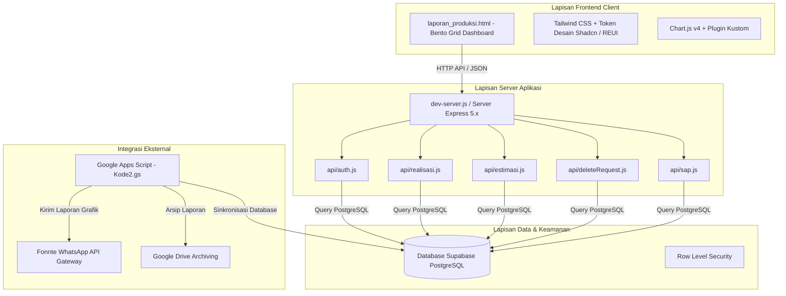

# 📋 AGRI-PAM - Product Requirement Document (PRD)

---

## 1. Ikhtisar Dokumen

### 1.1 Visi Produk
**AGRI-PAM (Agrinas Panen Monitoring)** adalah sistem pemantauan operasional dan dashboard enterprise berbasis real-time, hybrid-cloud yang dirancang khusus untuk **PT Agrinas Palma Nusantara**. Sistem ini menyediakan pelacakan terpusat, otomatis, dan real-time untuk estimasi panen kelapa sawit harian, realisasi produksi per jam, logistik pengiriman (Surat Angkut / SAP), serta pelaporan visual eksekutif otomatis via WhatsApp di seluruh unit regional perkebunan di Indonesia.

### 1.2 Pernyataan Masalah
- **Pelaporan Manual & Terfragmentasi**: Pelaporan terdahulu mengandalkan input manual Google Sheets dan pesan terpisah, menyebabkan keterlambatan data dan sinkronisasi.
- **Kesalahan Manusia & Input Terlambat**: Input terlambat atau pengisian tanggal di masa depan merusak akurasi prakiraan hasil panen.
- **Standarisasi Zona Waktu**: Unit perkebunan di wilayah Waktu Indonesia Barat (WIB) dan Waktu Indonesia Tengah (WITA) sering mengalami ketidaksesuaian waktu pelaporan.
- **Visibilitas Eksekutif yang Terbatas**: Pemangku kepentingan membutuhkan dashboard visual terpadu secara real-time yang membandingkan target RKAP dengan realisasi panen per jam.

### 1.3 Target Pengguna
1. **Pengguna Regional (Operator Kebun / Wilayah)**: Bertanggung jawab memasukkan realisasi panen per jam, target estimasi harian (Rencana Estimasi Panen), dan data pengiriman.
2. **Admin Pusat / Manajemen**: Bertanggung jawab memantau metrik panen nasional, meninjau kinerja regional, menyetujui/menolak permintaan hapus data, dan mengawasi logistik SAP.
3. **Pimpinan Eksekutif**: Menerima laporan visual grafik per jam otomatis yang dikirimkan ke grup WhatsApp manajemen.

---

## 2. Persona Pengguna & Hak Akses

| Peran | Hak Akses Utama | Target Pengguna |
|---|---|---|
| **Super Admin / Admin Pusat** | Akses penuh sistem: melihat data nasional, menyetujui/menolak permintaan hapus data, akses SAP Admin, memantau seluruh bento grid regional. | Manajemen Eksekutif, Operational Head Office |
| **Pengguna Regional** | Input/edit realisasi panen per jam, input target estimasi harian, toggle status "Hanya Pengiriman Restan", mengajukan hapus data, melihat dashboard regional. | Unit Regional Kebun (misal: Aceh, Riau, Kalbar, Kaltim, Sulteng, dll.) |

---

## 3. Persyaratan Fungsional Utama

### 3.1 Otentikasi & Manajemen Sesi
- **Login Aman**: Otentikasi via API kustom (`/api/auth`) dengan enkripsi password bcrypt yang tersimpan di PostgreSQL Supabase.
- **Manajemen Sesi JWT**: Menggunakan JSON Web Tokens (JWT) dengan durasi aktif 8 jam yang diaudit melalui tabel `sesi_aktif`.
- **Rate Limiting**: Membatasi percobaan login berulang untuk mencegah brute-force via tabel `rate_limit`.
- **Pengakhiran Sesi Otomatis**: Mengarahkan kembali pengguna secara otomatis ke `login.html` jika sesi telah berakhir.
- **Deteksi Zona Waktu Regional**: Otomatis menyesuaikan kalkulasi zona waktu (WIB atau WITA) berdasarkan wilayah yang login.

### 3.2 Realisasi Panen Per Jam Real-Time
- **Form Input Per Jam**: Operator melaporkan tonase hasil panen per jam (misal: `07.00`, `08.00`, ..., `18.00`).
- **Validasi Batas Waktu**:
  - **Jam Masa Depan**: Ditolak secara ketat (`targetRealUnixTimestamp > Date.now()`). Operator tidak dapat menginput data untuk jam yang belum tiba berdasarkan waktu server UTC.
  - **Jam Sekarang & Sebelumnya**: Diizinkan. Operator bebas mengisi jam berjalan atau jam yang terlewat tanpa perlu proses buka kunci (unlock).
  - **Deteksi Zona Waktu**: Otomatis menyesuaikan perhitungan waktu dengan offset 7 jam (WIB) atau 8 jam (WITA) sesuai pemetaan wilayah:
    - *Wilayah WITA*: Kalimantan Selatan 1 & 2, Kalimantan Timur, Kalimantan Utara, Sulawesi Tenggara, Sulawesi Tengah.
    - *Wilayah WIB*: Seluruh unit regional lainnya.
- **Penonaktifan Form Otomatis**: Mengunci tombol submit dan menampilkan Peringatan Shadcn saat jam masa depan dipilih.

### 3.3 Estimasi Panen Harian & Manajemen Status
- **Form Rencana Estimasi Panen**: Operator menginput metrik target harian (Luas Panen, Estimasi Panen, Estimasi Kirim, Restan Lalu, TK Panen).
- **Status "Hanya Pengiriman Restan" (Tidak Ada Panen)**:
  - Form memiliki tombol toggle interaktif `#btnTidakPanen`.
  - **Status Default (Aktif Panen)**: Tombol berwarna **HIJAU** (`#28a745`) dengan label `"Status: Aktif Panen (Klik jika Tidak Panen)"`.
  - **Status Toggle (Hanya Restan)**: Tombol berubah menjadi **MERAH** (`#dc3545`) dengan label `"Status: Hanya Pengiriman Restan (Aktif)"`. Input panen otomatis diisi angka `0` dan dikunci.
- **Indikator Status Modal Tabel**:
  - Setelah data estimasi dikirim, status simpan wilayah diperbarui di `data_estimasi`.
  - Pada modal tabel pengguna maupun admin, wilayah yang sudah melapor otomatis ditandai warna **HIJAU** (`#16a34a`) dengan centang (**✓**).

### 3.4 Bento Grid Dashboard & Visualisasi Data
- **Tata Letak Bento Responsive**: Desain modern berbasis Tailwind CSS (Jam Live, Kartu Target, Form Input, Grafik Chart.js, Modal Tabel).
- **Visualisasi Chart.js**:
  1. **Tren Produksi Per Jam (`#realisasiChart`)**: Menampilkan batang hasil panen per jam lengkap dengan garis tren dan plugin persentase perubahan (misal: `▲ +10.5%`).
  2. **Realisasi vs Estimasi Panen (`#realisasiVsEstimasiChart`)**: Menampilkan garis hijau realisasi aktual versus garis merah putus-putus target RKAP (`borderDash: [5, 5]`).
- **Sistem Desain Shadcn / REUI**:
  - Alert toast kustom (`window.showAlert`) dan alert inline (`window.renderInlineAlert`).
  - **Varian Alert Invert (`variant="invert"`)**: Tema gelap (`bg-slate-900 text-slate-50 border-slate-800`), ikon hijau sukses, dan tata letak responsif.
- **Mode Gelap & Terang**: Pengalih tema mendukung `data-theme="dark"` dengan penyimpanan preferensi di `localStorage`.

### 3.5 Integrasi Logistik SAP & Pengiriman
- Surat Angkut Digital terintegrasi via API (`/api/sap`).
- Antarmuka khusus untuk Admin SAP (`sap_admin.html`) dan Regional SAP (`sap_regional.html`) untuk memantau truk pengangkut, ID driver, PKS tujuan, dan berat netto.

### 3.6 Pelaporan Otomatis WhatsApp Dispatch
- Otomasi latar belakang menggunakan Google Apps Script (`Kode2.gs`).
- Berjalan otomatis per jam dari pukul `06.00` hingga `17.30` WIB.
- Mengambil screenshot visual dashboard, mengunggah ke Google Drive, dan mengirimkan kartu laporan ke grup WhatsApp manajemen via **Fonnte API Gateway**.

---

## 4. Arsitektur Teknis & Teknologi

### 4.1 Teknologi yang Digunakan
- **Frontend**: HTML5, Vanilla JavaScript (ES6+), Vanilla CSS, Tailwind CSS CDN, Chart.js (v4), Flatpickr Date Picker, Lucide Icons.
- **Backend**: Node.js, Express.js (v5), JSON Web Tokens (`jsonwebtoken`), dotenv.
- **Database**: PostgreSQL di Supabase (PostgREST + Service Role API).
- **Gateaway Otomasi**: Google Apps Script (GAS), Fonnte WhatsApp API.

---

## 5. Spesifikasi Skema Database

### 5.1 Tabel Utama

1. **`regions`**: Master data regional dan kredensial login.
   - `id` (`SERIAL`, Primary Key)
   - `region_name` (`VARCHAR`, Unique)
   - `password_hash` (`VARCHAR`, Hash Bcrypt)
   - `is_active` (`BOOLEAN`, Default: `true`)

2. **`database_input`**: Realisasi tonase panen per jam.
   - `id` (`BIGSERIAL`, Primary Key)
   - `tanggal` (`DATE`)
   - `jam` (`VARCHAR`, misal: `'08.00'`)
   - `tonase` (`NUMERIC`)
   - `region` (`VARCHAR`)
   - `created_at` (`TIMESTAMPTZ`)

3. **`data_estimasi`**: Target estimasi harian per wilayah.
   - `id` (`BIGSERIAL`, Primary Key)
   - `tanggal` (`DATE`)
   - `estimasi_panen_kg` (`NUMERIC`)
   - `estimasi_kirim_kg` (`NUMERIC`)
   - `luas_panen_ha` (`NUMERIC`)
   - `region` (`VARCHAR`)
   - `created_at` (`TIMESTAMPTZ`)

4. **`sesi_aktif`**: Audit token sesi dan verifikasi JWT.
   - `id` (`BIGSERIAL`, Primary Key)
   - `region` (`VARCHAR`)
   - `token` (`TEXT`)
   - `expiry` (`TIMESTAMPTZ`)
   - `status` (`VARCHAR`)

5. **`delete_requests`**: Pengajuan hapus data atau buka kunci.
   - `id` (`BIGSERIAL`, Primary Key)
   - `type` (`VARCHAR`, `'REALISASI'` / `'ESTIMASI'` / `'UNLOCK_REALISASI'`)
   - `region` (`VARCHAR`)
   - `tanggal` (`DATE`)
   - `jam` (`VARCHAR`)
   - `status` (`VARCHAR`, `'PENDING'` / `'APPROVED'` / `'REJECTED'`)
   - `requested_at` (`TIMESTAMPTZ`)

---

## 6. Persyaratan Non-Fungsional

1. **Keamanan**:
   - Password dienkripsi menggunakan `pgcrypto` / `bcrypt`.
   - Tabel database dilindungi oleh Row Level Security (RLS).
   - Enforce rate limiting pada rute otentikasi.
2. **Kinerja**:
   - Waktu muat halaman < 1.5 detik.
   - Render ulang grafik dan transisi input < 100ms.
   - Tanpa pergeseran tata letak (Zero Layout Shift) saat alert muncul.
3. **Kemudahan Penggunaan & Aksesibilitas**:
   - Kontras teks tinggi untuk keterbacaan operator kebun di bawah sinar matahari.
   - Elemen input responsif dan ramah perangkat seluler.
   - Dukungan mode gelap native mengurangi silau layar.

---

## 7. Riwayat Revisi & Pembaruan Terkini

| Tanggal | Fitur / Modifikasi | Rincian |
|---|---|---|
| **2026-07-23** | **Pemisahan Regional (Kalbar 1 → 1A & 1B)** | Mengubah nama `Kalimantan Barat 1` menjadi `Kalimantan Barat 1A` dan menambah akun `Kalimantan Barat 1B`. Mengubah pemetaan `CRO VI` mencakup `['Kalimantan Barat 1A', 'Kalimantan Barat 1B', 'Kalimantan Barat 2']`. Mengubah password Jambi (`ROJ4mb1`). |
| **2026-07-23** | **Otimisasi Paginasi Paralel API** | Memperbaiki batas 2.000 baris Supabase PostgREST di `/api/realisasi` & `/api/estimasi` menggunakan query paralel (`Promise.all` 10 page × 1.000 baris) agar grafik tren bulanan tampil utuh tanpa terputus di pertengahan bulan. |
| **2026-07-23** | **Konfigurasi CSP & Vercel** | Menambahkan `https://unpkg.com` dan `'unsafe-eval'` pada `Content-Security-Policy` di `vercel.json` untuk mendukung CDN React 18, Babel, dan Lucide. Menurunkan risiko timeout dengan set `maxDuration` 30 detik. |
| **2026-07-23** | **Sinkronisasi Input Tanggal React** | Menambahkan `data-noflatpickr="true"` pada input tanggal FilterBar `laporan_produksi.html` untuk menghindari konflik manipulasi DOM Flatpickr dengan controlled component React 18. |
