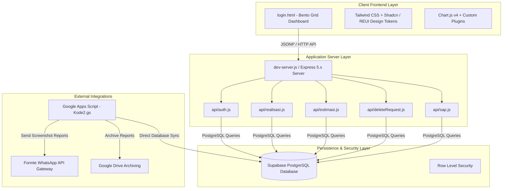

# 📋 AGRI-PAM - Product Requirement Document (PRD)

---

## 1. Document Overview

### 1.1 Product Vision
**AGRI-PAM (Agrinas Panen Monitoring)** is a real-time, hybrid-cloud enterprise dashboard and operational monitoring system designed for **PT Agrinas Palma Nusantara**. It provides centralized, automated, and real-time tracking of daily oil palm harvest estimations, hourly production realisations, shipping logistics (Surat Angkut / SAP), and automated executive WhatsApp dispatch reporting across 22 regional plantation units in Indonesia.

### 1.2 Problem Statement
- **Manual & Fragmented Reporting**: Legacy reporting relied on manual Google Sheets entries and scattered messaging, causing data latency and sync delays.
- **Human Error & Late Inputs**: Late inputs or future-dated entries undermined harvest forecasting accuracy.
- **Lack of Timezone Standardization**: Regional plantation units across Western Indonesia Time (WIB) and Central Indonesia Time (WITA) suffered from timing discrepancies.
- **Lack of Executive Visibility**: Stakeholders lacked a unified, real-time visual dashboard showing comparative RKAP targets versus actual hourly harvest realisations.

### 1.3 Target Audience
1. **Regional Users (Operator Kebun / Wilayah)**: Responsible for inputting hourly harvest realisations, daily estimation targets (Rencana Estimasi Panen), and shipping data.
2. **Admin Pusat / Management**: Responsible for monitoring nationwide harvest metrics, reviewing regional performance, approving data deletion requests, and overseeing SAP logistics.
3. **Executive Leadership**: Receives automated hourly WhatsApp visual chart reports dispatched to management groups.

---

## 2. User Personas & Permissions

| Role | Key Permissions | Target Users |
|---|---|---|
| **Super Admin / Admin Pusat** | Full system access: view nationwide data, approve/reject data deletion requests, access SAP Admin, view all 22 regional bento grids. | Executive Management, Operational Head Office |
| **Regional User** | Input/edit hourly harvest realisations, input daily estimation targets, toggle "Hanya Pengiriman Restan", request data deletion, view regional dashboard. | 22 Regional Units (e.g., Aceh, Riau, Kalbar, Kaltim, Sulteng, etc.) |

---

## 3. Core Functional Requirements

### 3.1 Authentication & Session Management
- **Secure Login**: Authentication via custom API (`/api/auth`) with bcrypt password hashing stored in Supabase PostgreSQL.
- **JWT Session Handling**: Issues JSON Web Tokens (JWT) with an 8-hour Time-to-Live (TTL) audited via `sesi_aktif` table.
- **Rate Limiting**: Protects against brute-force attacks via `rate_limit` table.
- **Automatic Session Expiration & Logout**: Gracefully redirects expired sessions back to `login.html`.
- **SSO & Regional Auto-Detect**: Automatically sets timezone (WIB or WITA) based on the logged-in region.

### 3.2 Real-Time Hourly Harvest Realisation
- **Hourly Input Form**: Operators report harvest tonnage per hour (e.g., `07.00`, `08.00`, ..., `18.00`).
- **Time Window Validation**:
  - **Future Hours**: Strictly **blocked** (`targetRealUnixTimestamp > Date.now()`). Operators cannot submit data for hours that have not yet occurred according to server UTC time.
  - **Past & Current Hours**: **Allowed**. Operators can fill current or overdue hours freely without requiring unlock approvals.
  - **Timezone Awareness**: Automatically offsets time calculations by 7 hours (WIB) or 8 hours (WITA) based on region mapping:
    - *WITA Regions*: Kalimantan Selatan 1 & 2, Kalimantan Timur, Kalimantan Utara, Sulawesi Tenggara, Sulawesi Tengah.
    - *WIB Regions*: All other regional units.
- **Form Auto-Disable**: Automatically disables submit button and shows custom Shadcn Warning Alert when selecting a future hour slot.

### 3.3 Daily Harvest Estimation & Status Management
- **Rencana Estimasi Panen Form**: Operators input daily target metrics (Luas Panen, Estimasi Panen, Estimasi Kirim, Restan Lalu, TK Panen).
- **Status "Hanya Pengiriman Restan" (Tidak Ada Panen)**:
  - Form includes an interactive toggle button `#btnTidakPanen`.
  - **Default State (Aktif Panen)**: Button displays **GREEN** (`#28a745`) with label `"Status: Aktif Panen (Klik jika Tidak Panen)"`.
  - **Toggled State (Tidak Panen / Restan Only)**: Button turns **RED** (`#dc3545`) with label `"Status: Hanya Pengiriman Restan (Aktif)"`. Harvest inputs (Luas Panen, Est Panen, etc.) auto-fill to `0` and disable.
- **Table Modal Status Mapping**:
  - Once an estimation form is submitted (whether active harvest or restan-only), the regional entry is saved in `database_estimasi`.
  - In both User/Regional and Admin Table Modals, completed regions automatically display **GREEN** (`#16a34a` / `#15803d`) with a checkmark (**✓**).

### 3.4 Bento Grid Dashboard & Data Visualisations
- **Responsive Bento Layout**: Mobile-first design using Tailwind CSS cards (Live Clock, Target Cards, Form Card, Chart Cards, Table Modals).
- **Chart.js Visualisations**:
  1. **Hourly Harvest Trend (`#realisasiChart`)**: Displays hourly harvest bars with trendlines and custom canvas plugins calculating percentage changes (e.g. `▲ +10.5%`).
  2. **Realisasi vs Estimasi Panen (`#realisasiVsEstimasiChart`)**: Displays solid green actual harvest lines versus red dashed RKAP target lines (`borderDash: [5, 5]`) with formatted data labels.
- **Shadcn / REUI Alert Design System**:
  - Custom toast alerts (`window.showAlert`) and inline alerts (`window.renderInlineAlert`).
  - **Alert Invert Variant (`variant="invert"`)**: Dark theme container (`bg-slate-900 text-slate-50 border-slate-800`), green `CircleAlertIcon` (`text-success`), and clean headers (`Notification!`, `Error!`, `Warning!`).
- **Dark & Light Mode Toggle**: Decoupled theme switcher supporting `data-theme="dark"` with persistent `localStorage` preference.

### 3.5 SAP Logistics & Shipping Integration
- Digital shipping letters (Surat Angkut Digital) integration accessible via `/api/sap`.
- Dedicated interface for SAP Admin (`sap_admin.html`) and SAP Regional (`sap_regional.html`) tracking delivery trucks, driver IDs, mill destinations, and net weights.

### 3.6 Automated WhatsApp Dispatch Reporting
- Background automation via Google Apps Script (`Kode2.gs`).
- Triggered hourly between `06.00` and `17.30` WIB.
- Renders headless dashboard chart screenshots, uploads to Google Drive, and dispatches visual report cards to WhatsApp management groups via **Fonnte API Gateway**.

---

## 4. Technical Architecture & Tech Stack

### 4.1 Technology Stack
- **Frontend**: HTML5, Vanilla JavaScript (ES6+), Vanilla CSS, Tailwind CSS CDN, Chart.js (v4), Flatpickr Date Picker, Lucide/Material Symbols.
- **Backend**: Node.js, Express.js (v5), JSON Web Tokens (`jsonwebtoken`), dotenv.
- **Database**: PostgreSQL hosted on Supabase (PostgREST + Service Role API).
- **Automation Gateway**: Google Apps Script (GAS), Fonnte WhatsApp API.

---

## 5. Database Schema Specification

### 5.1 Main Tables

1. **`regions`**: Regional master data and credentials.
   - `id` (`UUID`, Primary Key)
   - `region_name` (`VARCHAR`, Unique)
   - `password_hash` (`VARCHAR`, Bcrypt hash)
   - `is_active` (`BOOLEAN`, Default: `true`)

2. **`database_input`**: Real-time hourly harvest tonnage.
   - `id` (`BIGINT`, Primary Key)
   - `tanggal` (`DATE`)
   - `jam` (`VARCHAR`, e.g., `'08.00'`)
   - `tonase` (`NUMERIC`)
   - `region` (`VARCHAR`)
   - `created_at` (`TIMESTAMPTZ`)

3. **`data_estimasi`**: Daily target estimations per region.
   - `id` (`BIGINT`, Primary Key)
   - `tanggal` (`DATE`)
   - `est_panen` (`NUMERIC`, in kg)
   - `est_kirim` (`NUMERIC`, in kg)
   - `luas_panen` (`NUMERIC`)
   - `region` (`VARCHAR`)
   - `created_at` (`TIMESTAMPTZ`)

4. **`sesi_aktif`**: Session token audit and JWT verification.
   - `id` (`BIGINT`, Primary Key)
   - `region` (`VARCHAR`)
   - `token` (`TEXT`)
   - `expiry` (`TIMESTAMPTZ`)
   - `status` (`VARCHAR`, `'Aktif'` / `'Logout'`)

5. **`delete_requests`**: Workflow requests for data deletion or access un-locking.
   - `id` (`BIGINT`, Primary Key)
   - `type` (`VARCHAR`, `'REALISASI'` / `'ESTIMASI'` / `'UNLOCK_REALISASI'`)
   - `region` (`VARCHAR`)
   - `tanggal` (`DATE`)
   - `jam` (`VARCHAR`)
   - `status` (`VARCHAR`, `'PENDING'` / `'APPROVED'` / `'REJECTED'`)
   - `requested_at` (`TIMESTAMPTZ`)

---

## 6. Non-Functional Requirements

1. **Security**:
   - All passwords hashed using `pgcrypto` / `bcrypt`.
   - Database tables protected via Row Level Security (RLS).
   - Rate limiting enforced on authentication routes.
2. **Performance**:
   - Page load time < 1.5 seconds.
   - Chart rerendering and form input transitions < 100ms.
   - Zero layout shift when alerts expand (`items-start` grid alignment).
3. **Usability & Accessibility**:
   - High-contrast text elements for mobile operators in outdoor sunlight.
   - Touch-friendly input fields with custom Flatpickr mobile date pickers.
   - Native dark mode support eliminating screen glare.

---

## 7. Success Metrics (KPIs)

- **100% On-Time Reporting**: Eliminate missing hourly reports across all 22 regional units.
- **Zero Timezone Errors**: Seamless automated WIB/WITA shift calculations.
- **Rapid Operational Response**: Real-time visibility into RKAP target shortfalls via WhatsApp dispatch within 5 minutes of hour closure.
