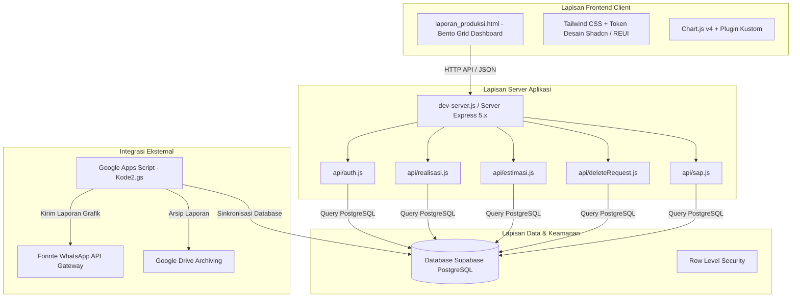

# 📋 AGRI-PAM - Product Requirement Document (PRD)

---

## 1. Ikhtisar Dokumen

### 1.1 Visi Produk
**AGRI-PAM (Agrinas Panen Monitoring)** adalah sistem pemantauan operasional dan dashboard enterprise berbasis real-time, hybrid-cloud yang dirancang khusus untuk **PT Agrinas Palma Nusantara**. Sistem ini menyediakan pelacakan terpusat, otomatis, dan real-time untuk estimasi panen kelapa sawit harian, realisasi produksi per jam, logistik pengiriman (Surat Angkut / SAP), serta pelaporan visual eksekutif otomatis via WhatsApp di seluruh unit regional perkebunan di Indonesia.

### 1.2 Pernyataan Masalah
- **Pelaporan Manual & Terfragmentasi**: Pelaporan terdahulu mengandalkan input manual Google Sheets dan pesan terpisah, menyebabkan keterlambatan data dan sinkronisasi.
- **Kesalahan Manusia & Input Terlambat**: Input terlambat atau pengisian tanggal di masa depan merusak akurasi prakiraan hasil panen.
- **Standarisasi Zona Waktu**: Unit perkebunan di wilayah Waktu Indonesia Barat (WIB) dan Waktu Indonesia Tengah (WITA) sering mengalami ketidaksesuaian waktu pelaporan.
- **Visibilitas Eksekutif yang Terbatas**: Pemangku kepentingan membutuhkan dashboard visual terpadu secara real-time yang membandingkan target RKAP dengan realisasi panen per jam.

### 1.3 Target Pengguna
1. **Pengguna Regional (Operator Kebun / Wilayah)**: Bertanggung jawab memasukkan realisasi panen per jam, target estimasi harian (Rencana Estimasi Panen), dan data pengiriman.
2. **Admin Pusat / Manajemen**: Bertanggung jawab memantau metrik panen nasional, meninjau kinerja regional, menyetujui/menolak permintaan hapus data, dan mengawasi logistik SAP.
3. **Pimpinan Eksekutif**: Menerima laporan visual grafik per jam otomatis yang dikirimkan ke grup WhatsApp manajemen.

---

## 2. Persona Pengguna & Hak Akses

| Peran | Hak Akses Utama | Target Pengguna |
|---|---|---|
| **Super Admin / Admin Pusat** | Akses penuh sistem: melihat data nasional, menyetujui/menolak permintaan hapus data, akses SAP Admin, memantau seluruh bento grid regional. | Manajemen Eksekutif, Operational Head Office |
| **Pengguna Regional** | Input/edit realisasi panen per jam, input target estimasi harian, toggle status "Hanya Pengiriman Restan", mengajukan hapus data, melihat dashboard regional. | Unit Regional Kebun (misal: Aceh, Riau, Kalbar, Kaltim, Sulteng, dll.) |

---

## 3. Persyaratan Fungsional Utama

### 3.1 Otentikasi & Manajemen Sesi
- **Login Aman**: Otentikasi via API kustom (`/api/auth`) dengan enkripsi password bcrypt yang tersimpan di PostgreSQL Supabase.
- **Manajemen Sesi JWT**: Menggunakan JSON Web Tokens (JWT) dengan durasi aktif 8 jam yang diaudit melalui tabel `sesi_aktif`.
- **Rate Limiting**: Membatasi percobaan login berulang untuk mencegah brute-force via tabel `rate_limit`.
- **Pengakhiran Sesi Otomatis**: Mengarahkan kembali pengguna secara otomatis ke `login.html` jika sesi telah berakhir.
- **Deteksi Zona Waktu Regional**: Otomatis menyesuaikan kalkulasi zona waktu (WIB atau WITA) berdasarkan wilayah yang login.

### 3.2 Realisasi Panen Per Jam Real-Time
- **Form Input Per Jam**: Operator melaporkan tonase hasil panen per jam (misal: `07.00`, `08.00`, ..., `18.00`).
- **Validasi Batas Waktu**:
  - **Jam Masa Depan**: Ditolak secara ketat (`targetRealUnixTimestamp > Date.now()`). Operator tidak dapat menginput data untuk jam yang belum tiba berdasarkan waktu server UTC.
  - **Jam Sekarang & Sebelumnya**: Diizinkan. Operator bebas mengisi jam berjalan atau jam yang terlewat tanpa perlu proses buka kunci (unlock).
  - **Deteksi Zona Waktu**: Otomatis menyesuaikan perhitungan waktu dengan offset 7 jam (WIB) atau 8 jam (WITA) sesuai pemetaan wilayah:
    - *Wilayah WITA*: Kalimantan Selatan 1 & 2, Kalimantan Timur, Kalimantan Utara, Sulawesi Tenggara, Sulawesi Tengah.
    - *Wilayah WIB*: Seluruh unit regional lainnya.
- **Penonaktifan Form Otomatis**: Mengunci tombol submit dan menampilkan Peringatan Shadcn saat jam masa depan dipilih.

### 3.3 Estimasi Panen Harian & Manajemen Status
- **Form Rencana Estimasi Panen**: Operator menginput metrik target harian (Luas Panen, Estimasi Panen, Estimasi Kirim, Restan Lalu, TK Panen).
- **Status "Hanya Pengiriman Restan" (Tidak Ada Panen)**:
  - Form memiliki tombol toggle interaktif `#btnTidakPanen`.
  - **Status Default (Aktif Panen)**: Tombol berwarna **HIJAU** (`#28a745`) dengan label `"Status: Aktif Panen (Klik jika Tidak Panen)"`.
  - **Status Toggle (Hanya Restan)**: Tombol berubah menjadi **MERAH** (`#dc3545`) dengan label `"Status: Hanya Pengiriman Restan (Aktif)"`. Input panen otomatis diisi angka `0` dan dikunci.
- **Indikator Status Modal Tabel**:
  - Setelah data estimasi dikirim, status simpan wilayah diperbarui di `data_estimasi`.
  - Pada modal tabel pengguna maupun admin, wilayah yang sudah melapor otomatis ditandai warna **HIJAU** (`#16a34a`) dengan centang (**✓**).

### 3.4 Bento Grid Dashboard & Visualisasi Data
- **Tata Letak Bento Responsive**: Desain modern berbasis Tailwind CSS (Jam Live, Kartu Target, Form Input, Grafik Chart.js, Modal Tabel).
- **Visualisasi Chart.js**:
  1. **Tren Produksi Per Jam (`#realisasiChart`)**: Menampilkan batang hasil panen per jam lengkap dengan garis tren dan plugin persentase perubahan (misal: `▲ +10.5%`).
  2. **Realisasi vs Estimasi Panen (`#realisasiVsEstimasiChart`)**: Menampilkan garis hijau realisasi aktual versus garis merah putus-putus target RKAP (`borderDash: [5, 5]`).
- **Sistem Desain Shadcn / REUI**:
  - Alert toast kustom (`window.showAlert`) dan alert inline (`window.renderInlineAlert`).
  - **Varian Alert Invert (`variant="invert"`)**: Tema gelap (`bg-slate-900 text-slate-50 border-slate-800`), ikon hijau sukses, dan tata letak responsif.
- **Mode Gelap & Terang**: Pengalih tema mendukung `data-theme="dark"` dengan penyimpanan preferensi di `localStorage`.

### 3.5 Integrasi Logistik SAP & Pengiriman
- Surat Angkut Digital terintegrasi via API (`/api/sap`).
- Antarmuka khusus untuk Admin SAP (`sap_admin.html`) dan Regional SAP (`sap_regional.html`) untuk memantau truk pengangkut, ID driver, PKS tujuan, dan berat netto.

### 3.6 Pelaporan Otomatis WhatsApp Dispatch
- Otomasi latar belakang menggunakan Google Apps Script (`Kode2.gs`).
- Berjalan otomatis per jam dari pukul `06.00` hingga `17.30` WIB.
- Mengambil screenshot visual dashboard, mengunggah ke Google Drive, dan mengirimkan kartu laporan ke grup WhatsApp manajemen via **Fonnte API Gateway**.

### 3.7 Alur Permohonan Revisi Tanggal Lampau (Past Date Revision & Approval System)
- **Navigasi Tanggal Terpusat**: Mengunci input tanggal di dalam kartu "Input Laporan Panen" (`readonly disabled`) dan menjadikan `#filterTanggalStart` ("TANGGAL" pada Filter Tampilan Data) sebagai *single source of truth* navigasi tanggal.
- **Pengajuan Revisi Regional (`ajukanRevisiTanggal`)**:
  - Jika Akun Regional memilih tanggal di masa lampau yang terkunci, form input akan menampilkan Alert REUI beserta tombol **`REVISI`** (berwarna Hijau Tua `bg-emerald-800`).
  - Menekan tombol **`REVISI`** akan memicu REUI Confirm Dialog (`showConfirm`) berikon perisai hijau (`ShieldCheckIcon`) dengan tombol **`Revisi`** warna **Hijau Tua**.
  - Permohonan revisi otomatis terkirim ke backend (`/api/unlockRequest` / `/api/deleteRequest`) dengan status `PENDING` dan tipe `UNLOCK_REALISASI`.
- **Panel Persetujuan Admin (`Persetujuan Request (Hapus & Buka Akses)`)**:
  - Admin Pusat menerima permohonan dan dapat menyetujui (**`Terima`**) atau menolak (**`Tolak`**).
  - **Diferensiasi Tipe Request pada Tabel Admin**:
    - **`Buka Est. Panen`**: Pengajuan permohonan buka akses dari modal Infografis Rencana Panen & Estimasi Panen.
    - **`Buka Real. Produksi`**: Pengajuan permohonan revisi laporan dari Input Laporan Panen / Realisasi Tiap Jam.
    - **`Hapus Data`**: Pengajuan permohonan hapus data laporan.
  - **Validasi Sisi Server (`/api/realisasi.js`)**: Memblokir perubahan/penghapusan tanggal lampau dari API kecuali jika terdapat rekaman berstatus `APPROVED` di database.

### 3.8 Pengumuman Pembaruan Sistem REUI (Agripam Update Pop-up & Confirm Dialog)
- **Agripam Update Pop-up (`showAgripamUpdateAnnouncement`)**:
  - Dirancang sesuai komponen REUI Alert (`<Alert>`, `<ShieldCheckIcon>`, `<AlertTitle>`, `<AlertDescription>`).
  - **Efek Visual**: Berada tepat di tengah layar (`fixed inset-0`) dengan layar latar belakang **Backdrop Blur** (`backdrop-blur-md bg-black/40`), tanpa tombol aksi agar tidak mengganggu visual, dan kartu berukuran besar yang sangat jelas/menonjol.
  - **Timer Countdown**: Dilengkapi progress bar countdown 5 detik dan akan menutup secara otomatis.
  - **Kontrol Sesi Login**: Pop-up pengumuman **HANYA muncul 1 kali saat proses login berhasil**, dan secara otomatis diabaikan saat pengguna melakukan **Refresh / F5** berdasarkan audit `sessionStorage` (`agripam_update_shown`).
- **Sistem Dialog Konfirmasi REUI (`window.showConfirm`)**:
  - Menggantikan dialog bawaan browser `confirm()` secara menyeluruh.
  - Beradaptasi sesuai konteks aksi:
    - **Buka Akses Estimasi**: Berikon perisai hijau, tombol bertuliskan **`Oke`** berwarna **Hijau** (`bg-emerald-600`).
    - **Revisi Realisasi**: Berikon perisai hijau, tombol bertuliskan **`Revisi`** berwarna **Hijau Tua** (`bg-emerald-800`).

---

## 4. Arsitektur Teknis & Teknologi

```mermaid
graph TD
    subgraph Client [Lapisan Frontend Client]
        UI[laporan_produksi.html - Bento Grid Dashboard]
        CSS[Tailwind CSS + Token Desain Shadcn / REUI]
        CJS[Chart.js v4 + Plugin Kustom]
    end

    subgraph Server [Lapisan Server Aplikasi]
        EXP[dev-server.js / Server Express 5.x]
        API_AUTH[api/auth.js]
        API_REAL[api/realisasi.js]
        API_EST[api/estimasi.js]
        API_DEL[api/deleteRequest.js]
        API_SAP[api/sap.js]
    end

    subgraph Database [Lapisan Data & Keamanan]
        PG[(Database Supabase PostgreSQL)]
        RLS[Row Level Security]
    end

    subgraph External [Integrasi Eksternal]
        GAS[Google Apps Script - Kode2.gs]
        WA[Fonnte WhatsApp API Gateway]
        GDrive[Google Drive Archiving]
    end

    UI -->|HTTP API / JSON| EXP
    EXP --> API_AUTH & API_REAL & API_EST & API_DEL & API_SAP
    API_AUTH & API_REAL & API_EST & API_DEL & API_SAP -->|Query PostgreSQL| PG
    GAS -->|Sinkronisasi Database| PG
    GAS -->|Kirim Laporan Grafik| WA
    GAS -->|Arsip Laporan| GDrive
```

### 4.1 Teknologi yang Digunakan
- **Frontend**: HTML5, Vanilla JavaScript (ES6+), Vanilla CSS, Tailwind CSS CDN, Chart.js (v4), Flatpickr Date Picker, Lucide Icons.
- **Backend**: Node.js, Express.js (v5), JSON Web Tokens (`jsonwebtoken`), dotenv.
- **Database**: PostgreSQL di Supabase (PostgREST + Service Role API).
- **Gateaway Otomasi**: Google Apps Script (GAS), Fonnte WhatsApp API.

---

## 5. Spesifikasi Skema Database

### 5.1 Tabel Utama

1. **`regions`**: Master data regional dan kredensial login.
   - `id` (`SERIAL`, Primary Key)
   - `region_name` (`VARCHAR`, Unique)
   - `password_hash` (`VARCHAR`, Hash Bcrypt)
   - `is_active` (`BOOLEAN`, Default: `true`)

2. **`database_input`**: Realisasi tonase panen per jam.
   - `id` (`BIGSERIAL`, Primary Key)
   - `tanggal` (`DATE`)
   - `jam` (`VARCHAR`, misal: `'08.00'`)
   - `tonase` (`NUMERIC`)
   - `region` (`VARCHAR`)
   - `created_at` (`TIMESTAMPTZ`)

3. **`data_estimasi`**: Target estimasi harian per wilayah.
   - `id` (`BIGSERIAL`, Primary Key)
   - `tanggal` (`DATE`)
   - `estimasi_panen_kg` (`NUMERIC`)
   - `estimasi_kirim_kg` (`NUMERIC`)
   - `luas_panen_ha` (`NUMERIC`)
   - `region` (`VARCHAR`)
   - `created_at` (`TIMESTAMPTZ`)

4. **`sesi_aktif`**: Audit token sesi dan verifikasi JWT.
   - `id` (`BIGSERIAL`, Primary Key)
   - `region` (`VARCHAR`)
   - `token` (`TEXT`)
   - `expiry` (`TIMESTAMPTZ`)
   - `status` (`VARCHAR`)

5. **`delete_requests`**: Pengajuan hapus data atau buka kunci.
   - `id` (`BIGSERIAL`, Primary Key)
   - `type` (`VARCHAR`, `'REALISASI'` / `'ESTIMASI'` / `'UNLOCK_REALISASI'`)
   - `region` (`VARCHAR`)
   - `tanggal` (`DATE`)
   - `jam` (`VARCHAR`)
   - `status` (`VARCHAR`, `'PENDING'` / `'APPROVED'` / `'REJECTED'`)
   - `requested_at` (`TIMESTAMPTZ`)

---

## 6. Persyaratan Non-Fungsional

1. **Keamanan**:
   - Password dienkripsi menggunakan `pgcrypto` / `bcrypt`.
   - Tabel database dilindungi oleh Row Level Security (RLS).
   - Enforce rate limiting pada rute otentikasi.
2. **Kinerja**:
   - Waktu muat halaman < 1.5 detik.
   - Render ulang grafik dan transisi input < 100ms.
   - Tanpa pergeseran tata letak (Zero Layout Shift) saat alert muncul.
3. **Kemudahan Penggunaan & Aksesibilitas**:
   - Kontras teks tinggi untuk keterbacaan operator kebun di bawah sinar matahari.
   - Elemen input responsif dan ramah perangkat seluler.
   - Dukungan mode gelap native mengurangi silau layar.

---

## 7. Riwayat Revisi & Pembaruan Terkini

| Tanggal | Fitur / Modifikasi | Rincian |
|---|---|---|
| **2026-08-18** | **Penambahan 78 Kebun Baru & Sinkronisasi Database** | Menambahkan 78 kebun baru (bebas duplikasi nama) dari file tambahan excel ke database Supabase dan file fallback lokal [data_kebun_tk.json](file:///d:/AGRINAS%20PALMA%20NUSANTARA/AGRIPAM/data_kebun_tk.json) dengan ID berlanjut dari 801 s/d 878. Memperbarui script parser [parse_and_update_all_tk_data.py](file:///d:/AGRINAS%20PALMA%20NUSANTARA/AGRIPAM/parse_and_update_all_tk_data.py) agar mendukung logika deduplikasi otomatis (exact & fuzzy matching) untuk kedua file excel. |
| **2026-08-11** | **Pembaruan Panel Executive Highlight & Ekspor Excel TK Panen** | Memperbarui deteksi indeks kolom LHP untuk TBS Kirim (Kolom F) dan TBS Panen (Kolom M). Mendesain ulang panel *Executive Intelligence Highlight* dengan warna adaptif (teks hitam/putih, background terang `#d9d9d9`, dan warna *gold* direvisi menjadi `#B8860B`). Menambahkan fitur *Export Excel* (.xls) pada modal *Monitoring & Rekapitulasi TK Panen* lengkap dengan format styling langsung (header `#4BACC6`, teks tebal Arial, perataan tengah, garis tipis 0.5pt), serta merender otomatis ikon trend SVG menjadi simbol teks unicode (`▲` hijau, `▼` merah) agar dapat dirender oleh Microsoft Excel. |
| **2026-08-07** | **Penyempurnaan UI/UX Dashboard Regional** | Memindahkan tombol **Input Laporan Panen** ke barisan *Filter Tampilan Data* secara responsif dengan penyesuaian ukuran (*fit to text*) dan warna cyan (`#46bdc6`). Menambahkan dukungan angka riil tonase (bukan sekadar persentase) pada label luar *Donut Chart*, memperbesar ukurannya agar proporsional, serta mengaktifkan fungsi sinkronisasi warna teks persentase dengan *Dark Mode*. Mengubah tombol *close* pada *sheet* input menjadi tombol silang merah berbingkai. |
| **2026-08-06** | **Pembaruan Form Modal TK Panen & Perbaikan API Sinkronisasi** | Menambahkan isian baru `Ketersediaan TK Panen Juli` di dalam modal Edit Data Kebun, mengubah label form menjadi `Ketersediaan TK Panen Juni`, serta mengimplementasikan perhitungannya ke dalam kalkulasi 4 kolom validasi (`login.html` & `laporan_produksi.html`). Selain itu, dilakukan perbaikan kritis (bugfix) pada sinkronisasi API `/api/kebunTK`, dimana fungsi penulisan `update` Supabase PostgreSQL kini telah menerapkan asinkronis (await) untuk mencegah isu overwriting oleh data usang saat proses muat ulang tabel di panel Admin. |
| **2026-08-06** | **Pembaruan Tabel TK Panen & Optimistic UI Admin** | Mengubah *styling* tabel TK Panen dengan grid hitam pekat (`border-black`), penyesuaian font teks baris menjadi `14px`, penyederhanaan judul header menjadi "TREND", serta modifikasi badge indikator agar angka dan simbol trend tidak lagi dibalut kotak latar. Pembaruan paling krusial: Implementasi **Optimistic UI Update** yang memungkinkan perubahaan tabel secara instan / *real-time* saat akun Admin mengedit data TK Panen di halaman Admin (`laporan_produksi.html`), tanpa ada jeda tunggu server. |
| **2026-08-03** | **Penyelarasan Aturan Lintas Bulan dengan Akses Admin** | Memperbaiki konflik validasi pada `api/realisasi.js`. Mengizinkan input & revisi data realisasi panen pada tanggal di luar bulan berjalan apabila permohonan revisi telah disetujui oleh Admin (`status: APPROVED`) atau diakses oleh akun Admin. |
| **2026-08-07** | **Penyempurnaan Monitor TK Panen & Data Luasan** | Melakukan refactoring *border* tabel Monitoring Rekapitulasi TK Panen dengan *border-separate* dan *z-index* untuk menghindari garis tabel dari sel *tbody* tembus pada area *sticky header* ketika melakukan scroll. Modifikasi sumber kalkulasi "Luasan" pada modal agar menggunakan data statis/rujukan baku dari `Luas TM Planted (Ha)` (seperti pada `Kalbar 1` yang merupakan total `Kalbar 1A` dan `1B`) dan menonaktifkan "Papua Selatan" dari daftar agregat di tabel pop-up. Pembaruan teks pemberitahuan rilis (*Agripam Update*). |
| **2026-08-03** | **Dukungan Format Baru Target Challenge (.csv & .xlsx)** | Memperbarui parser `TargetChallengeModal` di `laporan_produksi.html` agar otomatis mengenali struktur Target Harian Wilayah format baru (`CRO / Wilayah`, `Regional`, `Tgl 1-31`). Otomatis menyaring baris Subtotal CRO dari file agar tidak terjadi penggandaan dan mengkalkulasi Subtotal per CRO secara dinamis di aplikasi. |
| **2026-07-25** | **Pembaruan Luasan & Penamaan Kalbar 1A & 1B** | Mengubah label `Kalbar 1A Ex Duta Palma` menjadi `Kalbar 1A`. Mengakomodasi luasan persis Kalbar 1A (39.838,88 Ha) dan Kalbar 1B (38.117,11 Ha) dengan total luasan Planted tetap 444.447 Ha di seluruh modul Rencana & Realisasi, Estimasi Panen, Panen Monitoring, Validasi Data, dan SAP Persuratan. |
| **2026-07-24** | **Sistem Pengumuman Agripam Update REUI** | Menambahkan pengumuman pop-up bergaya REUI Alert (`ShieldCheckIcon`) dengan layar latar belakang Backdrop Blur (`backdrop-blur-md bg-black/40`), timer 5 detik, dan kontrol sesi (`agripam_update_shown`) sehingga HANYA tampil 1x saat login dan diabaikan saat F5/refresh. |
| **2026-07-24** | **Fitur Revisi Tanggal Lampau (Past Date Revision)** | Menghubungkan navigasi tanggal terpusat via `#filterTanggalStart`. Mengunci input tanggal Laporan Panen. Menambahkan tombol REUI `REVISI` (Hijau Tua) untuk pengajuan revisi tanggal lampau dari Regional ke Admin Pusat. |
| **2026-07-24** | **Diferensiasi Tipe Request Admin** | Memperbarui tabel persetujuan Admin (*Persetujuan Request (Hapus & Buka Akses)*) agar membedakan secara eksplisit antara permohonan **`Buka Est. Panen`** (dari Estimasi Panen), **`Buka Real. Produksi`** (dari Input Realisasi Panen), dan **`Hapus Data`**. |
| **2026-07-24** | **Sistem REUI Confirm Dialog (`window.showConfirm`)** | Menghapus dialog `confirm()` bawaan browser. Menggantinya dengan REUI Modal Dialog yang mendukung varian **`Oke`** (tombol Hijau `bg-emerald-600`) untuk Buka Akses Estimasi dan **`Revisi`** (tombol Hijau Tua `bg-emerald-800`) untuk Revisi Realisasi. |
| **2026-07-23** | **Pemisahan Regional (Kalbar 1 → 1A & 1B)** | Mengubah nama `Kalimantan Barat 1` menjadi `Kalimantan Barat 1A` dan menambah akun `Kalimantan Barat 1B`. Mengubah pemetaan `CRO VI` mencakup `['Kalimantan Barat 1A', 'Kalimantan Barat 1B', 'Kalimantan Barat 2']`. Mengubah password Jambi (`ROJ4mb1`). |
| **2026-07-23** | **Otimisasi Paginasi Paralel API** | Memperbaiki batas 2.000 baris Supabase PostgREST di `/api/realisasi` & `/api/estimasi` menggunakan query paralel (`Promise.all` 10 page × 1.000 baris) agar grafik tren bulanan tampil utuh tanpa terputus di pertengahan bulan. |
| **2026-07-23** | **Konfigurasi CSP & Vercel** | Menambahkan `https://unpkg.com` dan `'unsafe-eval'` pada `Content-Security-Policy` di `vercel.json` untuk mendukung CDN React 18, Babel, dan Lucide. Menurunkan risiko timeout dengan set `maxDuration` 30 detik. |
| **2026-07-23** | **Sinkronisasi Input Tanggal React** | Menambahkan `data-noflatpickr="true"` pada input tanggal FilterBar `laporan_produksi.html` untuk menghindari konflik manipulasi DOM Flatpickr dengan controlled component React 18. |
